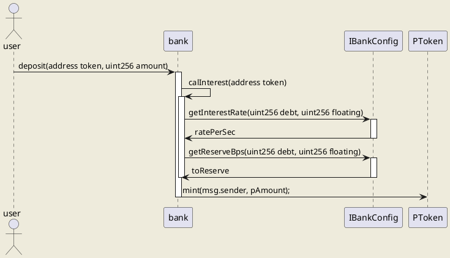

# contract
Smart Contract of Pilot finance lab

## test with ganache-cli

ganache-cli -l 0x1ffffffffffff -e 1000000000 --allowUnlimitedContractSize -m "extra antenna lottery stand lend panic banner sausage arctic easily ball blast"


## Heco
### Heco Mainnet

```
https://http-mainnet-node.huobichain.com
128
HT
https://hecoinfo.com
```


### Heco test net

[官方文档](https://support.hbfile.net/hc/en-us/articles/900003862766-Huobi-Officially-Launched-Huobi-ECO-Chain-Heco-Testnet )

```
Official website: www.hecochain.com
Beta address:
chainid 256
RPC wss://ws-testnet.hecochain.com
https://http-testnet.hecochain.com
Browser: https://scan-testnet.hecochain.com
Faucet address: https://scan-testnet.hecochain.com/faucet

```

### 部署
先要知道以下合约地址
```
mdx router
各个币的地址
池子的参数
```

合约部署顺序如下：
```
TripleSlopeModel
bank config
bank
strategy: StrategyAllBNBOnly, StrategyLiquidate, StrategyWithdrawMinimizeTrading
price oracle
goblin config
pools： PancakeswapPool1Goblin, PancakeswapGoblin
``` 

## 存钱

### 存钱序列图


### 存钱算法

看代码

## 取钱

